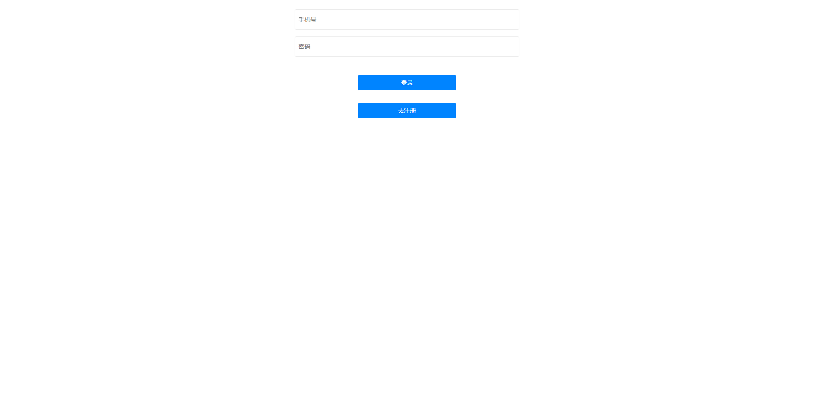
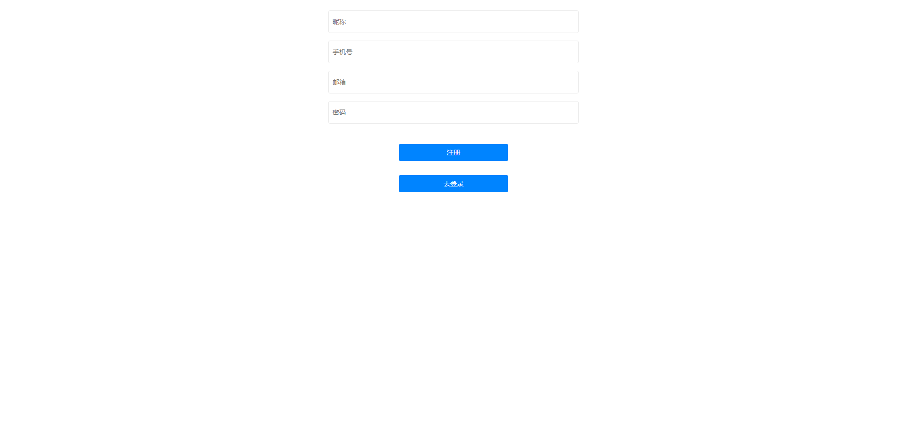
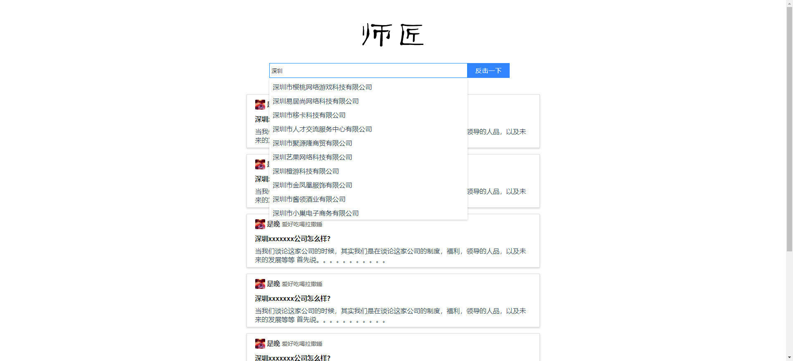

# alone_front

师匠,为职场公平而生
这是一个查询招聘公司评价的网站.

# Todo List
1:注册信息验证  done
2:光标聚焦输入框边框变色 done
3:对接用户注册,登录接口 done
4:使用富文本回答问题
5:svg图标组件
6:表单验证
7:公司信息页面展示
8:对接搜索公司
9:登录拦截
10:欢迎页
11:集成iView组件库
12:搭建后台管理端
# 项目介绍:
  这个项目是师匠的的前端项目,使用vue-cli创建完成,主要技术栈有vue,vue-router,webpack,sass,
  目前还没有引入主流的UI框架,该项目力求设计简单,界面以大方简洁已操作为准,多使用组件
  首页/#/shijiang/index
  
# 项目截图

# 开发须知:
  该项目启用了eslint验证,在webstrom下开发会自动验证是否符合编码规范,原则上有报错不允许提交.
  目前views/shijiang下的每个页面的样式都抽离到scss/shijiang下面名字一一对应.
  项目主色调为 蓝色 #3385ff
  圆角4px
  风格接近知乎
  图标使用svg 目前还没有创建对应组件 阿里巴巴图标库 http://www.iconfont.cn/

# 规范标准:

# 规划
6月底需要将注册,登录,修改个人资料,任职经历,公司搜素,公司评价功能完成

# 写到最后
  如果对项目有好的建议,或者想要贡献代码,请发邮件到2272862992@qq.com
